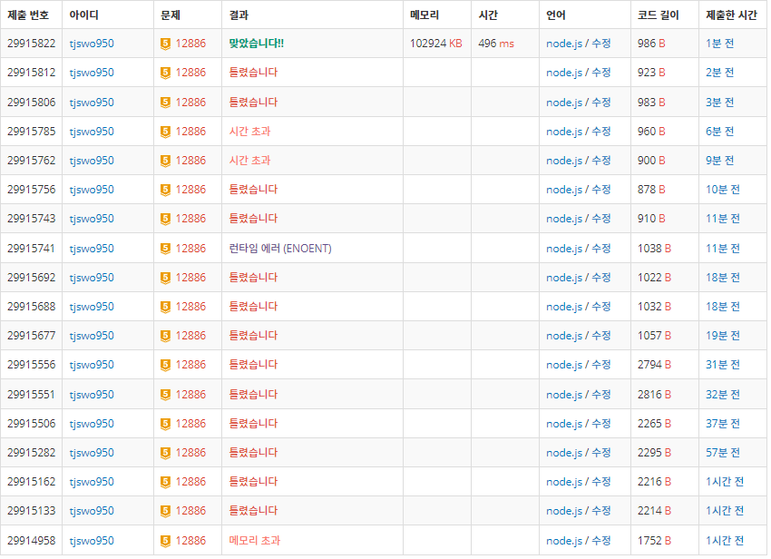

# 12886 돌그룹

### 나의 풀이

```javascript
const fs = require("fs");
const inputs = fs
  .readFileSync("/dev/stdin")
  .toString()
  .trim()
  .split(" ")
  .map((v) => parseInt(v))
  .sort((a, b) => a - b);

function solution(inputs) {
  const sum = inputs.reduce((pre, cur) => pre + cur);
  //모두 같지 않을때
  if (sum % 3 !== 0) return 0;
  const visited = new Array(1501)
    .fill(null)
    .map((v) => new Array(1501).fill(false));
  const queue = [inputs];
  //방문 표시 경우의수 6개
  for (let i = 0; i < 3; i++) {
    for (let j = 0; j < 3; j++) {
      if (i === j) continue;
      visited[inputs[i]][inputs[j]] = true;
    }
  }
  let point = 0;
  while (queue.length > point) {
    const end = queue.length;
    while (end > point) {
      const [x, y, z] = queue[point++];
      //1.처음 중간
      if (y - x > 0) {
        const add = [2 * x, y - x, z].sort((a, b) => a - b);
        if (!visited[add[0]][add[1]]) {
          if (add[0] === sum / 3 && add[1] === sum / 3 && add[2] === sum / 3) {
            return 1;
          }
          queue.push(add);
          for (let i = 0; i < 3; i++) {
            for (let j = 0; j < 3; j++) {
              if (i === j) continue;
              visited[add[i]][add[j]] = true;
            }
          }
        }
      }
      //2.처음 마지막
      if (z - x > 0) {
        const add = [2 * x, y, z - x].sort((a, b) => a - b);
        if (!visited[add[0]][add[1]]) {
          if (add[0] === sum / 3 && add[1] === sum / 3 && add[2] === sum / 3) {
            return 1;
          }
          queue.push(add);
          for (let i = 0; i < 3; i++) {
            for (let j = 0; j < 3; j++) {
              if (i === j) continue;
              visited[add[i]][add[j]] = true;
            }
          }
        }
      }
      //3.중간 마지막
      if (z - y > 0) {
        const add = [x, 2 * y, z - y].sort((a, b) => a - b);
        if (!visited[add[0]][add[1]]) {
          if (add[0] === sum / 3 && add[1] === sum / 3 && add[2] === sum / 3) {
            return 1;
          }
          queue.push(add);
          for (let i = 0; i < 3; i++) {
            for (let j = 0; j < 3; j++) {
              if (i === j) continue;
              visited[add[i]][add[j]] = true;
            }
          }
        }
      }
    }
  }
  return 0;
}
console.log(solution(inputs));
```

### 다른사람풀이

참고: <https://www.acmicpc.net/board/view/51452>

1. 합을 3으로 나눴을 때 0이 아니라면 0출력
2. 1번때 출력되지않으면 아래와같이 진행
3. 방문 배열을 각1501크기인 2차원배열로 선언
4. bfs에서 파라미터로 받은 x,y를 방문해주고 bfs알고리즘 사용
5. a라는 `[x,y,합-x-y]` 배열을 선언해서 2중배열을 돌려준다.
6. a라는 배열에서 각 요소당 비교해서 작은것과 큰것이 나타나면 `visited[작은것][큰것]`을 방문하지않는다면 queue에 삽입과 방문
7. bfs가 종료된후에 `visited[합/3][합/3]`이라면 1출력 아니면 0출력

### 고친나의풀이

```javascript
const fs = require("fs");
const inputs = fs
  .readFileSync("/dev/stdin")
  .toString()
  .split(" ")
  .map((v) => parseInt(v));
//합 구하기
const sum = inputs.reduce((pre, cur) => pre + cur);
//방문 배열 생성
const visited = new Array(1501)
  .fill(null)
  .map((v) => new Array(1501).fill(false));

function bfs(x, y, sum) {
  const queue = [[x, y]];
  visited[x][y] = true;
  let point = 0;
  while (queue.length > point) {
    const [a, b] = queue[point++];
    const add = [a, b, sum - a - b];
    for (let i = 0; i < 3; i++) {
      for (let j = 0; j < 3; j++) {
        if (add[i] < add[j]) {
          const nx = add[i] * 2;
          const ny = add[j] - add[i];
          if (!visited[nx][ny]) {
            queue.push([nx, ny]);
            visited[nx][ny] = true;
          }
        }
      }
    }
  }
}
//강제 종료 조건
if (sum % 3 !== 0) {
  console.log(0);
} else {
  bfs(inputs[0], inputs[1], sum);

  if (visited[parseInt(sum / 3)][parseInt(sum / 3)]) {
    console.log(1);
  } else {
    console.log(0);
  }
}
```


### 주의할점

1. 3개를 비교하는것이 아닌 두개로 비교한다는것에 중점을 둘것...(처음에 visited를 3차원배열로 선언해서 500^3개만큼 메모리차지해서 메모리초과나옴)
2. 합이 3으로 나눴을 때 나머지가 0을 판단하는 조건문
3. bfs함수에서 a,b로 비구조할당하고 add 배열을 만들때 헷갈리는것 주의

